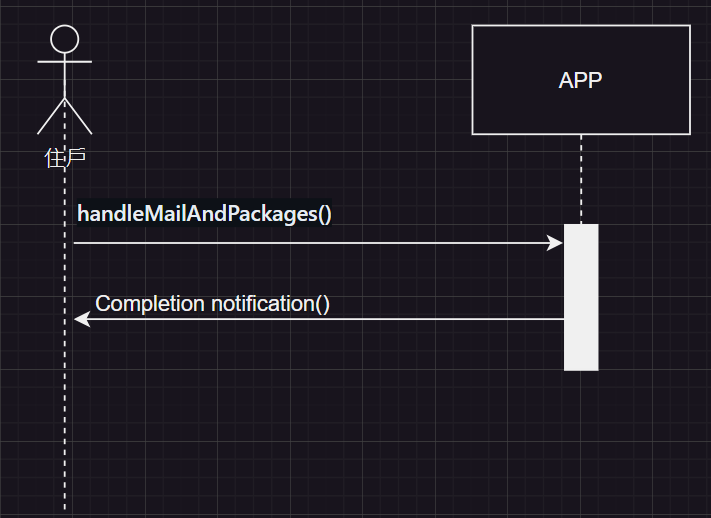
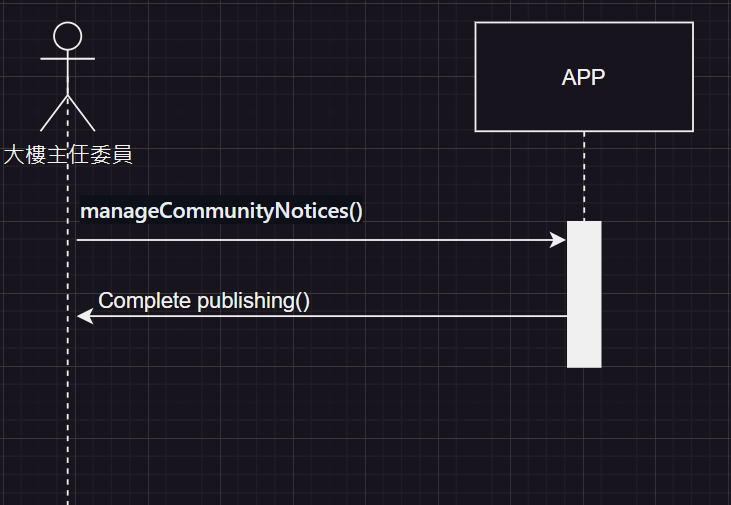
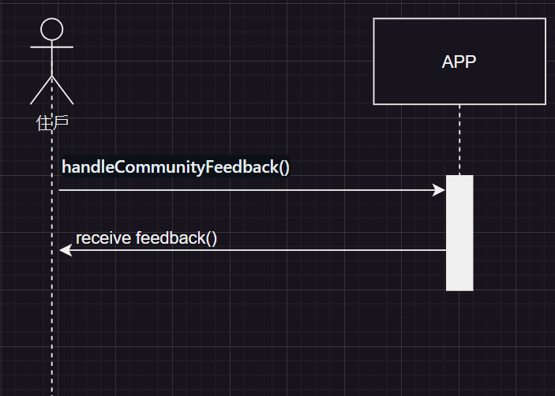
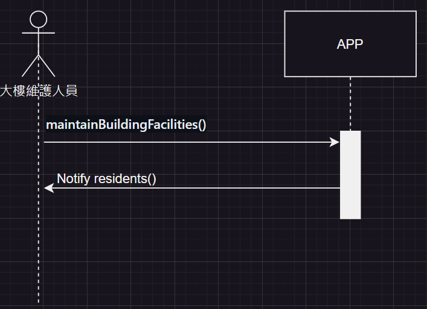
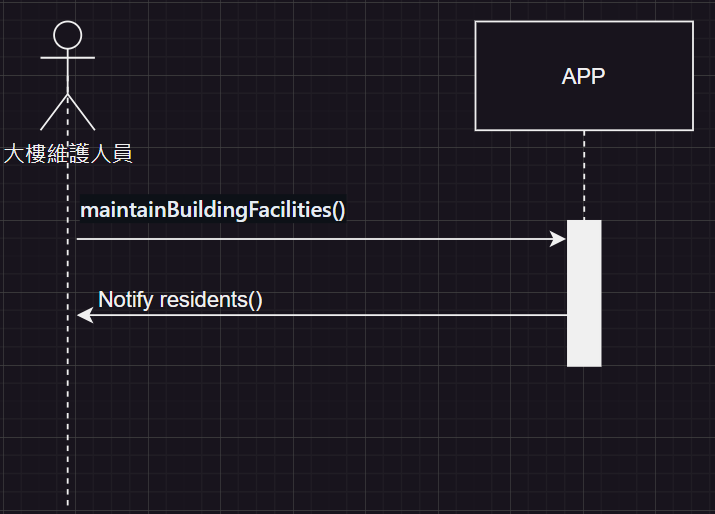

# 第4次作業-作業-HW4
>
>學號：111111109
> 
>姓名：張雅薰
> 
>作業撰寫時間：50 (mins，包含程式撰寫時間)
> 
>最後撰寫文件日期：2024/05/27
>

本份文件包含以下主題：(至少需下面兩項，若是有多者可以自行新增)
- [x] 說明內容
- [x] 個人認為完成作業須具備觀念

## 說明程式與內容
(a)初步類別圖

(b)使用案例圖與合約
1. 收發信件/包裹

|合約1| handleMailAndPackages()|
|----------|------|
|操作:| handleMailAndPackages()|
|交互參照:|接收和分發住戶的信件和包裹|
|前置條件:|信件和包裹已送達社區管理處|
|後置條件:|住戶收到通知並取走信件或包裹|

2. 管理社區公告

|合約2 |manageCommunityNotices()|
|----------|------|
|操作:|manageCommunityNotices()|
|交互參照:|發佈和管理社區公告|
|前置條件:|有通知住戶的社區公告事項|
|後置條件:|公告成功發佈|

3. 社區問題反饋與解決

|合約3 |handleCommunityFeedback()|
|----------|------|
|操作:|handleCommunityFeedback()|
|交互參照:|接收並處理住戶反饋的社區問題|
|前置條件:|住戶已提交社區問題反饋|
|後置條件:|問題獲得處理並反饋結果給住戶|

4. 大樓設施維護

|合約4 |maintainBuildingFacilities()|
|----------|------|
|操作:|maintainBuildingFacilities()|
|交互參照:|進行大樓設施的維護和檢修|
|前置條件:|定期維護計劃或設備故障報告|
|後置條件:|設施維護完成並記錄維修情況|

5. 社區活動管理

|合約5|manageCommunityEvents()|
|----------|------|
|操作:|manageCommunityEvents()|
|交互參照:|組織和管理社區活動|
|前置條件:|社區活動計劃已確定並通知住戶|
|後置條件:|活動順利舉辦並記錄活動結果|

## 個人認為完成作業須具備觀念

根據利害關係人表與事件表做出使用案例圖與合約，每一步都需要反覆確認與修改才能完成本次作業。 
使用案例圖的設計：
根據事件與使用案例表，設計使用案例圖來展示系統的功能範圍和使用者互動。 
合約的撰寫：
根據使用案例圖撰寫相應的合約，確保合約涵蓋了使用案例中的前提條件、後置條件和保證。